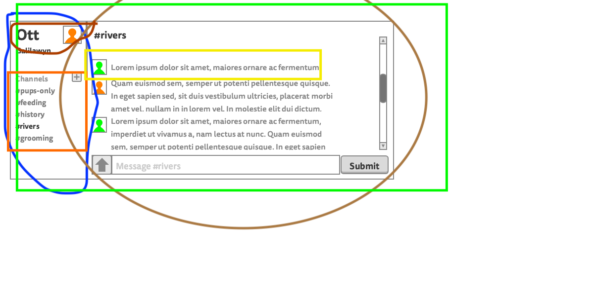

# React: Components, Props, and Children

## Learning Goals

1. Describe the purpose of the virtual DOM
1. * Compare the virtual DOM to the actual DOM
1. Contrast imperative and declarative programming
1. * Identify components from a wireframe and draw out the flow of information
1. Describe the component hierarchy using the terms root, parent, and child
1. Create a React app that renders "Hello, World!" to the screen
1. Define the term prop in the context of React
1. List the types of data that can be passed as props
1. * Explain the benefits or drawbacks of using the tool `create-react-app`
1. Create a React app that renders a container, one list, and five list items

## Objectives

- Take the wireframe from our design team and
  - ~~Identify components~~
  - ~~Map out the initial component hierarchy~~
- Create a new React app using `create-react-app`
  - ~~Remove all boilerplate code~~
  - ~~In [`app`](./ott/src/App.js) component, render "Hello, World!"~~
  - Import dummy data from [`data.js`](./ott/src/data.js)
  - Create a static app from the wireframe

## Components

* app `data`
  * navigation
    * profile `data.user`
    * channels `data.channels`
  * messages `data.channels => loop through, get the currently selected => render those messages`
    * message

## Questions/Notes
* Where and how to put the whole page together; the content of the website
* When and where should I start implementing vanilla JS?
* What is the backend that we're using? How do we interact w/ that in React?
* How can we build a barebones React app without cra?
* Different ways to import functions?
* ~~Using props in components~~
* ~~Flow of information in the React app~~
* ~~The new ways that you can write functions and classes~~
